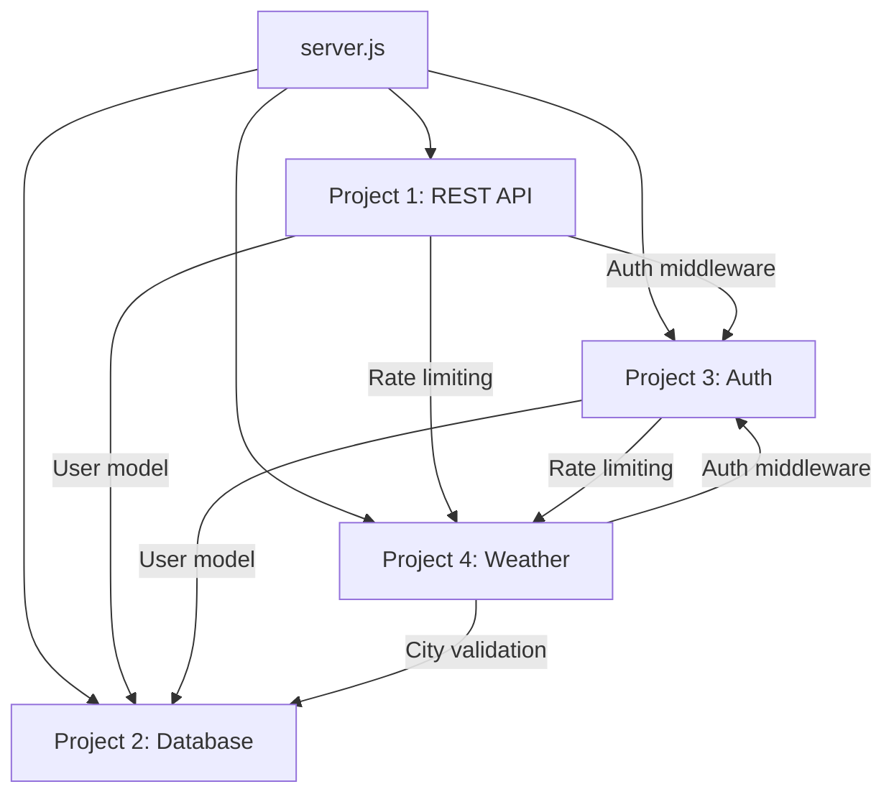

# DecodeLabs Backend — Project Guide

This codebase implements all **four DecodeLabs curriculum projects** as clearly separated, self-contained modules under `projects/`.

## Project Overview

```
backend/
├── projects/                          ← All 4 projects live here
│   ├── index.js                       ← Central project registry
│   ├── project1-rest-api/             ← PROJECT 1: REST API Fundamentals
│   ├── project2-database/             ← PROJECT 2: Database Integration
│   ├── project3-authentication/       ← PROJECT 3: Secure Authentication
│   └── project4-weather-api/          ← PROJECT 4: Third-Party API Integration
├── server.js                          ← Composes all 4 projects
├── scripts/                           ← Uses Project 2 (database)
├── tests/                             ← Organized by project
│   ├── project1/
│   ├── project2/
│   ├── project3/
│   └── project4/
└── docs/API.md
```

## Project Map

### Project 1: REST API Fundamentals
**Folder:** `projects/project1-rest-api/`

| File | Purpose |
|------|---------|
| `index.js` | Mounts `/api/users`, registers `/health` |
| `controllers/userController.js` | User CRUD handlers |
| `routes/userRoutes.js` | RESTful route definitions |

**Endpoints:** `GET /health`, `GET/POST/PUT/DELETE /api/users`

---

### Project 2: Database Integration
**Folder:** `projects/project2-database/`

| File | Purpose |
|------|---------|
| `index.js` | Database initialization |
| `config/db.js` | MongoDB connection |
| `models/User.js` | Mongoose schema & indexes |
| `utils/validators.js` | Input validation |
| `middleware/errorHandler.js` | Global error handling |

**Provides:** Persistent storage for Projects 1, 3, and 4.

---

### Project 3: Secure Authentication
**Folder:** `projects/project3-authentication/`

| File | Purpose |
|------|---------|
| `index.js` | Mounts `/api/auth` |
| `controllers/authController.js` | Register, login, logout, profile |
| `middleware/auth.js` | JWT `protect`, `authorize`, `verifyEmail` |
| `routes/authRoutes.js` | Authentication endpoints |

**Endpoints:** `POST /api/auth/register`, `/login`, `/logout`, `GET /me`, `PUT /updatepassword`

**Also secures:** User routes in Project 1 via middleware imports.

---

### Project 4: Third-Party API Integration
**Folder:** `projects/project4-weather-api/`

| File | Purpose |
|------|---------|
| `index.js` | Mounts `/api/weather` |
| `controllers/weatherController.js` | OpenWeatherMap integration |
| `middleware/cache.js` | In-memory TTL cache |
| `middleware/rateLimiter.js` | Rate limiting |
| `utils/circuitBreaker.js` | Circuit breaker pattern |
| `routes/weatherRoutes.js` | Weather endpoints |

**Endpoints:** `GET /api/weather/current`, `/forecast`, `POST /multiple`, `GET /cache/clear`

---

## How Projects Connect



## Startup Order (in server.js)

1. **Shared middleware** — Helmet, CORS, compression, body parsing
2. **Project 4** — Global rate limiting
3. **Project 1** — Health check + user routes
4. **Project 3** — Auth routes
5. **Project 4** — Weather routes
6. **Project 2** — Error handlers + MongoDB connection

## Identifying Project Code

Every source file includes a header comment:

```javascript
/**
 * PROJECT N: <Project Name>
 * ...
 */
```

Each project folder contains its own `README.md` with scope, files, and endpoints.

## Quick Verification

After starting the server, the console prints all loaded projects:

```
═══════════════════════════════════════════════════════════
  DecodeLabs Backend — All 4 Projects Loaded
═══════════════════════════════════════════════════════════
  Project 1: REST API Fundamentals  →  /health, /api/users
  Project 2: Database Integration       →  MongoDB (...)
  Project 3: Secure Authentication  →  /api/auth
  Project 4: Third-Party API Integration  →  /api/weather
═══════════════════════════════════════════════════════════
```
